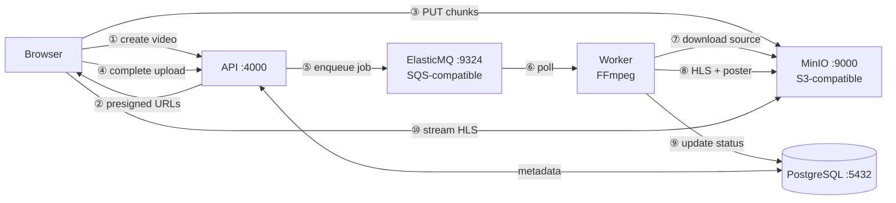
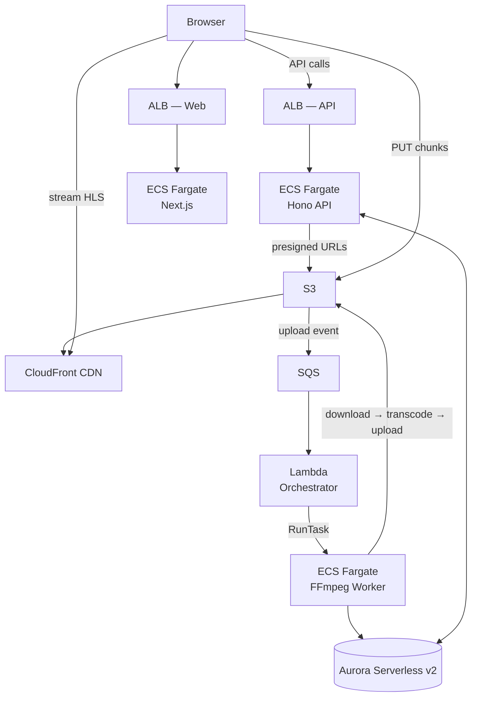

# stream-ops


**Stack:** Bun · Next.js 15 · Hono · PostgreSQL · FFmpeg · AWS CDK

A self-hosted video streaming platform. Upload a video, get back an adaptive HLS stream at multiple quality levels — with a poster thumbnail and a custom web player.

## Overview

stream-ops lets you upload MP4 or WebM videos through a web UI, then automatically transcodes them into HLS format (1080p / 720p / 480p) using FFmpeg. The resulting stream and poster are served through a CDN-backed player. Locally, everything runs in Docker Compose with MinIO and ElasticMQ as AWS stand-ins. In production the same workload runs on ECS Fargate, Aurora Serverless, S3, and CloudFront.

## Architecture

### Development (Docker Compose)



### Production (AWS)



> Detailed diagram with VPC, subnets, security groups, IAM roles, and port map: [`docs/architecture.md`](docs/architecture.md)

## Monorepo Layout

| Path | What it is | README |
|------|-----------|--------|
| `apps/api` | Hono REST API — upload coordination, metadata, job dispatch | [→](apps/api/README.md) |
| `apps/web` | Next.js 15 frontend — upload UI, HLS player, video library | [→](apps/web/README.md) |
| `apps/orchestrator` | Lambda handler — S3 events → ECS RunTask (production) | [→](apps/orchestrator/README.md) |
| `services/worker` | FFmpeg transcoding worker — HLS pipeline, poster generation | [→](services/worker/README.md) |
| `infra` | AWS CDK stack — ECS Fargate, Aurora, SQS, S3, CloudFront | [→](infra/README.md) |
| `packages/db` | Drizzle ORM schema and client (shared) | [→](packages/db/README.md) |
| `packages/types` | Shared TypeScript types | [→](packages/types/README.md) |
| `packages/logger` | Structured JSON logger (shared) | [→](packages/logger/README.md) |

## Quickstart (Local Dev)

**Prerequisites:** [Bun ≥ 1.3.9](https://bun.sh) · Docker

```bash
# 1. Clone
git clone <repo-url> stream-ops && cd stream-ops

# 2. Install dependencies
bun install

# 3. Start the full local stack (postgres, minio, elasticmq, api, worker, web)
docker compose up -d

# 4. Open the app
open http://localhost:3000
```

MinIO console (bucket browser): http://localhost:9001  
API health check: http://localhost:4000

> To run with hot-reload outside Docker (faster iteration):
> ```bash
> docker compose up -d postgres db-migrate minio minio-init elasticmq   # infrastructure only
> cp .env.local.example .env.local
> bun run dev             # start api + web with Turbo watch
> ```
> Note: `bun run dev:db` starts postgres + migrations and then launches Turbo dev automatically — it does not start MinIO or ElasticMQ. Use the explicit `docker compose up -d` command above if you need the full infrastructure.

## Environment Variables

Two templates are provided:

| File | Purpose |
|------|---------|
| `.env.example` | Production — AWS credentials, bucket names, database URL |
| `.env.local.example` | Local dev — pre-filled values that match `docker-compose.yml` |

Copy the appropriate file, rename it (remove `.example`), and fill in any blanks. **Never commit a filled-in copy.**

## Scripts

Run from the monorepo root with `bun run <script>`:

| Script | What it does |
|--------|-------------|
| `dev` | Start all apps in watch mode (Turbo) |
| `dev:db` | Start postgres + run DB migrations in Docker, then start all apps except worker (Turbo watch) |
| `dev:docker` | Start the full stack in Docker (`docker compose up -d`) |
| `build` | Build all apps and packages (Turbo) |
| `lint` | ESLint across all packages |
| `format` | Prettier format all `*.ts` / `*.tsx` / `*.md` files |
| `check-types` | TypeScript type-check across all packages |

## Deployment (AWS)

Deployment uses AWS CDK from the `infra/` directory. It is a two-pass process because the web image must be built with the API URL baked in as a build arg.

```bash
# Pass 1 — bootstrap (once per AWS account/region) + first deploy
cd infra
npx cdk bootstrap aws://ACCOUNT_ID/REGION
bun run deploy

# Capture outputs from CloudFormation:
# ApiUrl   → the ALB DNS for the API
# AssetBaseUrl → the CloudFront URL for assets

# Pass 2 — set the captured URLs in infra/bin/app.ts, then redeploy
bun run deploy
```

See [`infra/README.md`](infra/README.md) for full configuration options and construct details.
