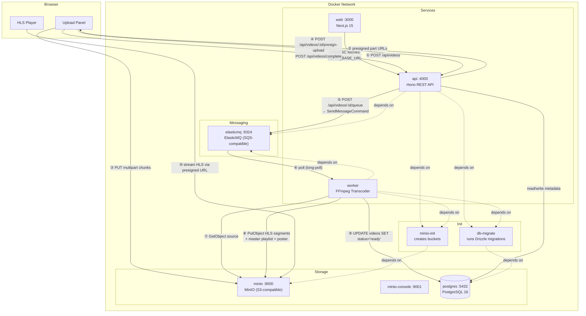
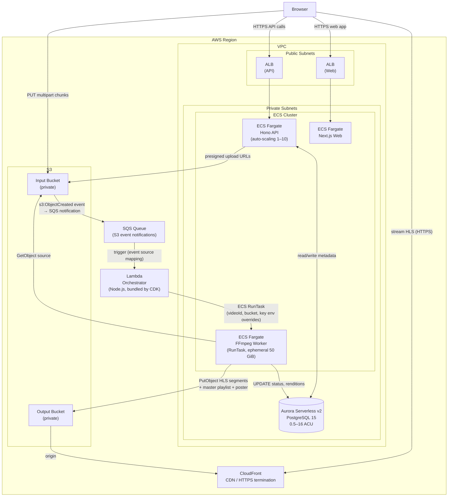

# stream-ops — Architecture Reference

Detailed Mermaid diagrams for reference. The root README contains simplified versions.

---

## Development Environment (Docker Compose)

**Port summary:**

| Service | Port | Purpose |
|---------|------|---------|
| api | 4000 | REST API |
| web | 3000 | Next.js frontend |
| postgres | 5432 | Database |
| minio | 9000 | Object storage (S3-compatible) |
| minio-console | 9001 | MinIO web UI |
| elasticmq | 9324 | Message queue (SQS-compatible) |

---

## Production Environment (AWS)

**CDK constructs → AWS resources:**

| Construct | Resources provisioned |
|-----------|----------------------|
| `Network` | VPC, 2 public + 2 private subnets, NAT Gateway, security groups |
| `Storage` | S3 input bucket (private), S3 output bucket (private), CloudFront distribution |
| `Database` | Aurora Serverless v2 cluster (PostgreSQL 15), secret in Secrets Manager |
| `Queue` | SQS standard queue with S3 event notification |
| `Orchestrator` | Lambda function, event source mapping from SQS, IAM role |
| `ApiService` | ECS Fargate service, ALB, task definition, auto-scaling (1–10), IAM task role |
| `Worker` | ECS Fargate task definition + IAM role (not a service — RunTask only) |
| `WebService` | ECS Fargate service, ALB, task definition, IAM task role |

**Fargate sizing defaults (editable in `infra/lib/config.ts`):**

| Service | CPU | Memory | Notes |
|---------|-----|--------|-------|
| API | 512 | 1024 MiB | scales 1–10 |
| Web | 512 | 1024 MiB | — |
| Worker | 2048 | 4096 MiB | ephemeral storage: 50 GiB (FFmpeg CPU-bound) |
| DB | 0.5–16 ACU | — | Aurora auto-scales to zero when idle |
